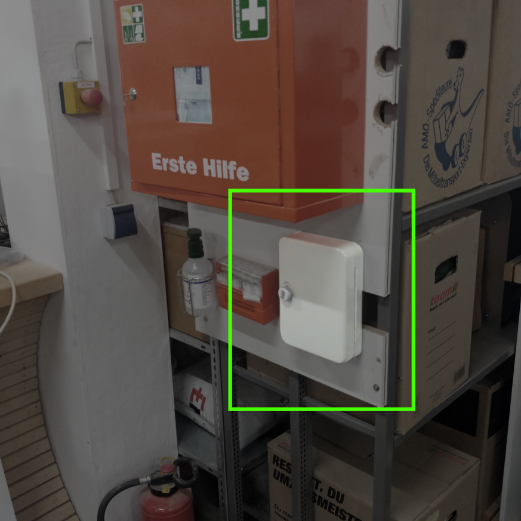
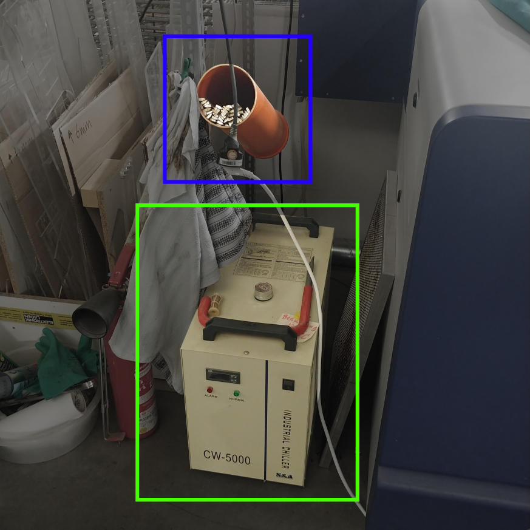
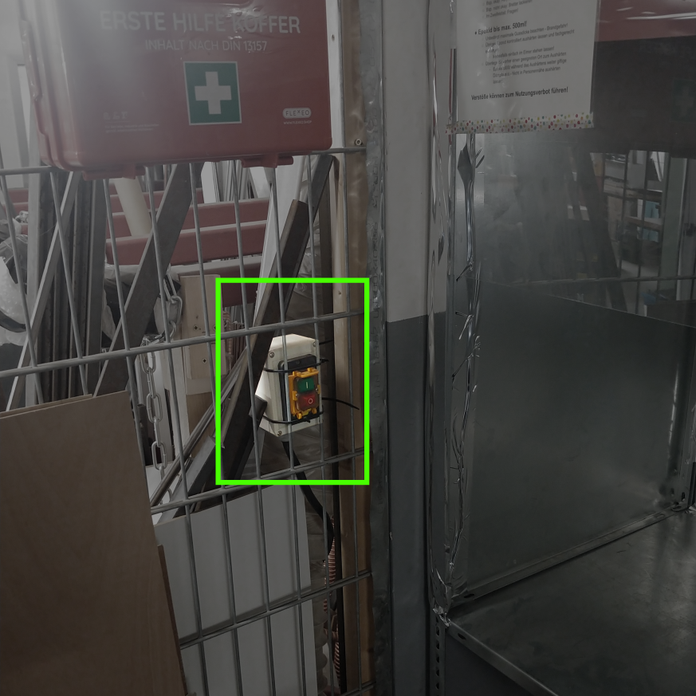

# Gerät einschalten & vorbereiten

Zum Einschalten des Geräts müssen die folgenden Schritte durchgeführt werden:

1. Schubladen-Schlüssel aus der Schlüsselbox holen
2. Schublade am Laser öffnen, um an den Geräteschlüssel zu gelangen
3. Geräteschlüssel einstecken und drehen
4. Abwarten bis der Laserkopf sich vollständig ausgerichtet hat

=== "Schlüsselbox"

    

=== "Chiller & Stäbe"

    

=== "Lüftung"

    