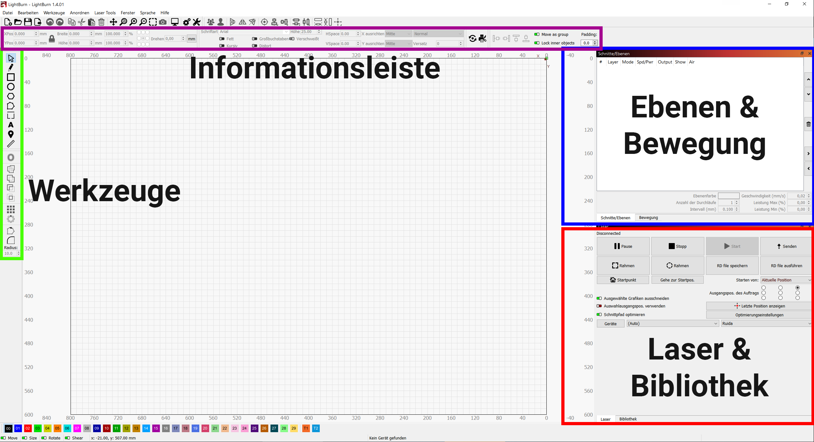

# Einführung in Lightburn

=== "Werkzeuge"

    Hier findest Du verschiedene Werkzeuge für den Umgang mit der Arbeitsfläche:

    - Grundlegende Formen
    - Text
    - Positionswerkzeug, um den Laserkopf an eine bestimmte Stelle zu bewegen
    - Boolsche Operationen (Formen zusammenfügen/ trennen/ etc.)
    - Array-Werkzeuge, um ein Schnittmuster automatisch zu vervielfältigen
    - Bearbeitungswerkzeuge für Punkte/ Ecken

=== "Informationsleiste"

    Hier werden Informationen (u.a. Position, Größe) zum aktuell ausgewählten Objekt angezeigt. Wenn ein Text ausgewählt ist, dann kann hier die Schriftart, -größe usw. eingestellt werden.

    Im rechten Teil der Leiste befinden sich erweiterte Funktionen zum Anordnen von Objekten.

=== "Ebenen"

    Schnittmuster können auf mehrere Ebenen verteilt werden. So kannst Du bequem unterschiedliche Teile deines Schnittmusters mit unterschiedlichen Einstellungen lasern.

    Bei den Ebenen wird die Art des Laserns (Schneiden/ Gravur) sowie die Laserstärke eingestellt. Bei Bedarf auch andere Einstellungen (z.B. Anzahl der Durchgänge, Versatz).

    Die Bedienfelder *Ebenen* und *Bewegung* befinden sich an der gleichen Stelle. Man wechselt zwischen beiden über die Tabs.

=== "Bewegung"

    Hier kann der Laserkopf manuell gesteuert. Dabei kann die Geschwindigkeit und die Schrittweite eingestellt werden.

    Je nach persönlicher Arbeitsweise ersetzt oder ergänzt dieses Bedienfeld die Steuerung direkt am Gerät.

=== "Laser"

    Hier erfolgt die grundlegende Steuerung des Laservorgangs (Start, Stop, Pause, Ausgangspunkt des Laserns).

=== "Bibliothek"

    In der Materialbibliothek können Einstellungen zum Lasern abgelegt werden, sodass diese später bequem wiederverwendet können.