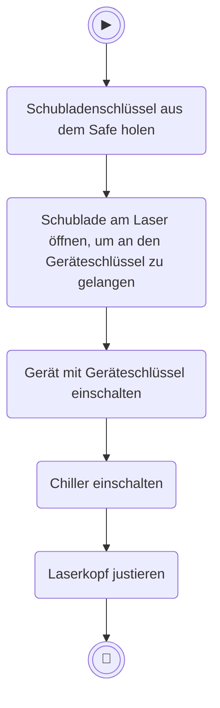
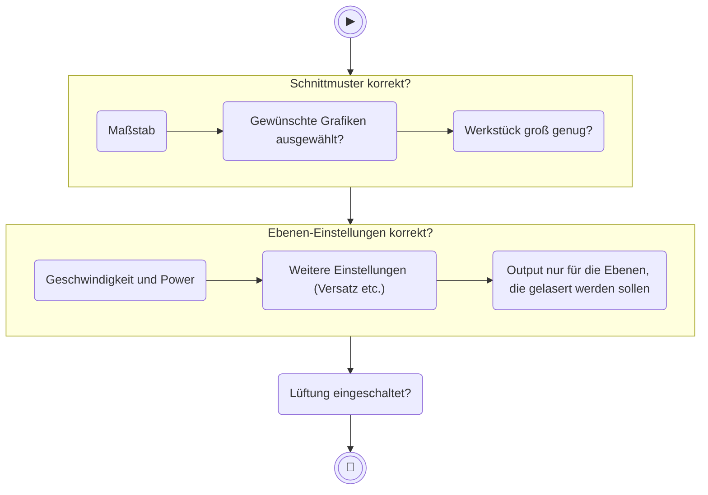
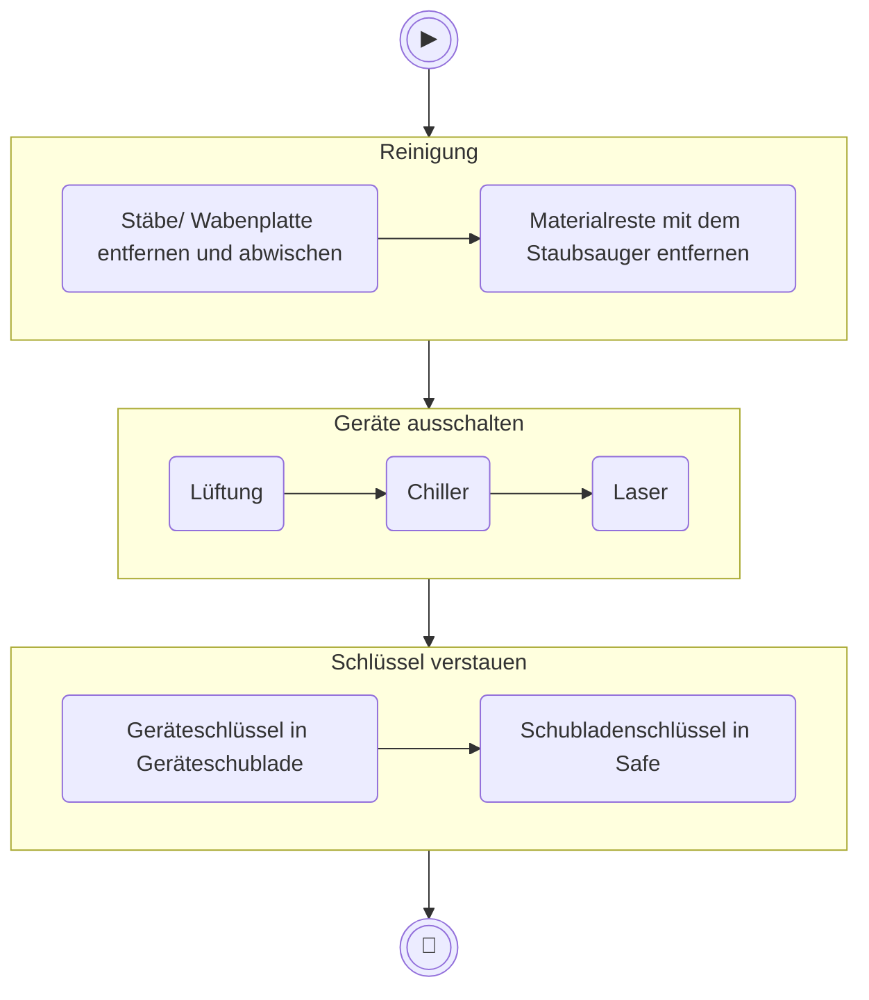

# Checklisten

## Arbeit am Laser beginnen

```mermaid
flowchart TD
    %% Standardknoten
    start((("▶")))
    ende((("🏁")))
    class start mm_test;

    %% Knoten-Abfolge
    start
    --> 2("Schubladenschlüssel aus dem Safe holen")
    --> 3("Schublade am Laser öffnen, um an den Geräteschlüssel zu gelangen")
    --> 4("Gerät mit Geräteschlüssel einschalten")
    --> 5("Chiller einschalten")
    --> 6(Laserkopf justieren)
    --> ende
```

 

## Laservorgang durchführen

```mermaid
flowchart TD
    %% Standardknoten
    start((("▶")))
    ende((("🏁")))

    %% Subgraphen
    subgraph form["Schnittmuster korrekt?"]
        form_1("Maßstab")
        --> form_2("Gewünschte Grafiken ausgewählt?")
        --> form_3("Werkstück groß genug?")
    end

    subgraph ebenen["Ebenen-Einstellungen korrekt?"]
        ebenen_1("Geschwindigkeit und Power")
        --> ebenen_2("Weitere Einstellungen (Versatz etc.)")
        --> ebenen_3("Output nur für die Ebenen, die gelasert werden sollen")
    end

    %% Knoten-Abfolge
    start
    --> form
    --> ebenen
    --> lüftung("Lüftung eingeschaltet?")
    --> ende
```

 

## Arbeit am Laser beenden

```mermaid
flowchart TD
    %% Standardknoten
    start((("▶")))
    ende((("🏁")))

    %% Subgraphen
    subgraph reinigung["Reinigung"]
        unterlage("Stäbe/ Wabenplatte entfernen und abwischen")
        --> saugen("Materialreste mit dem Staubsauger entfernen")
    end

    subgraph strom["Geräte ausschalten"]
        direction LR
        strom_1("Lüftung")
        -->strom_2("Chiller")
        -->strom_3("Laser")
    end

    subgraph schlüssel["Schlüssel verstauen"]
        schlüssel_1("Geräteschlüssel in Geräteschublade")
        -->schlüssel_2("Schubladenschlüssel in Safe")
    end

    %% Knoten-Abfolge
    start
    --> reinigung
    --> strom
    --> schlüssel
    --> ende
```

 
